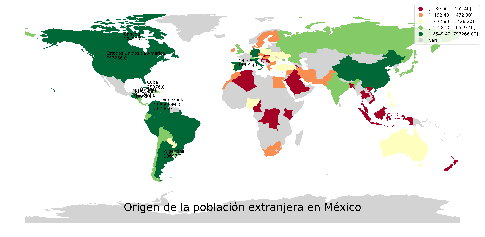

# Welcome to my "#30DayMapChallenge 2021"

>The idea is to create (and publish) maps based on different themes on each day of the month using the hashtag #30DayMapChallenge, You can prepare the maps beforehand, but the main idea is to publish maps from specific topics on specific days listed below. Just include a picture of the map when you post to Twitter with the hashtag. You don't have to sign up anywhere to participate. There are no restrictions on the tools, technologies or the data you use in your maps. Doing less than 30 is also fine (doing all 30 is really hard!). 
>Topi Tjukanov (@tjukanov)

Being completely honest, when I found there was a challenge for making maps, I decided I should get into it. At first, I was using QGIS, it wasn't bad but watching some incredible maps made in Python made get me the idea of giving it a chance. 

## 📊 Contributions

| Category             |  Example |
:-------------------------:|:-------------------------:
[Day 1: Points]()  |  
[Day 2: Lines]()  |  
[Day 3: Polygons]()  |  
[Day 4: Hexagons]()  |  
[Day 5: Data challenge 1: OpenStreetMap](files/DataChallenge1.ipynb)  |  
[Day 6: Red]()  |  
[Day 7: Green]()  |  
[Day 8: Blue]()  |  
[Day 9: Monochrome](files/Monochrome.ipynb) |  
[Day 10: Raster](files/Raster.ipynb) |  
[Day 11: 3D](files/3D.ipynb)  |  
[Day 12: Population](files/Poblacion.ipynb)  |  
[Day 15: Map made without using a computer (*Isotherm*)  |  ]
[Day 16: Urban/rural ](files/Urban&Rural.ipynb)  |  
[Day 17: Land ](files/Land.ipynb)  |  
[Day 18: Water ](files/Water.ipynb)  |  
[Day 19: (*Heat*) Island(s) ](files/Islands.ipynb)  |  
[Day 22: Boundaries ](files/Boundaries.ipynb)  |  
[Day 23: Data challenge 3: GHSL Global Human Settlement Layer ](files/DataChallenge3_GHSL.ipynb)  |  
[Day 25: Interactive map ](files/Interactive.ipynb)  |  
[Day 26: Choropleth map ](files/Chrolopleth.ipynb)  |  
[Day 30: Metamapping day](files/Chrolopleth.ipynb)  |  

I would like to thank to tjukanovt which idea [#30DayMapChallenge](https://github.com/tjukanovt/30DayMapChallenge) is really fascinating and created a big community around the globe. I get astonished every night, looking so many maps. 

And also a recognition to [Nicole Paul](https://github.com/nicolepaul/30-day-map-challenge) , whose repository encourage me for making this  and share the little I learnt in this month. Please give it a look. 

Edgar Zavaleta